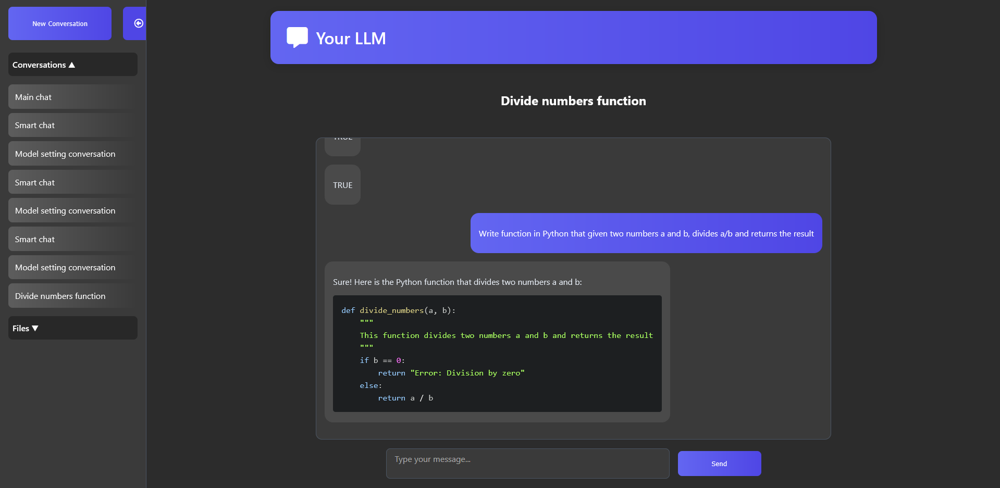

# LLM Chat UI

A chat interface for interacting with a Large Language Model (LLM), built with **React** and a basic **Node.js (Express)** backend.  
The backend now integrates with **Google Sheets** to communicate with an external LLM and store conversation and file metadata

---

## Features

- Responsive chat UI (desktop & mobile)
- User and bot message styling
- Smooth text input with Enter-to-send
- Modular React components with scoped CSS Modules
- Express backend for:
  - Chat handling via Google Sheets communication
  - Conversation history loading/saving
  - Code file browsing, saving, editing and deletion
- Google Sheets as a lightweight DB proxy to external LLM
- Easy local development with one command to start both frontend and backend

---

## Getting Started

### Prerequisites

- [Node.js](https://nodejs.org/) (version 18+ recommended)
- [npm](https://www.npmjs.com/)
- Google service account with access to a Google Sheet (see `sheet-key.json`)

---

### Installation

Follow these steps to set up the project locally:

1. **Clone the repository:**

```bash
git clone https://github.com/GWeronika/LLM-model-frontend.git
cd LLM-model-frontend
```
2. **Install all dependencies:**

```bash
npm install
```
3. **Add Google Sheets credentials:**

Place your Google service account key file as `sheet-key.json` in the project root. Make sure the associated account has edit access to the target Google Sheet.

---

### Running the App

You have two options depending on your preference:

#### Option 1: Start frontend and backend separately

1. **Backend Server:**

Open the first terminal and run:

```bash
npm run server
```

This will start the backend server at **[http://localhost:5000](http://localhost:5000)**.

2. **Frontend (React app):**

Open the second terminal and run:

```bash
npm start
```

This will start the frontend React app at **[http://localhost:3000](http://localhost:3000)**.

The frontend automatically proxies requests to the backend `/chat` endpoint via the proxy setup in `package.json`.

---

#### Option 2: Start frontend and backend together (recommended)

In a single terminal, run:

```bash
npm run dev
```

This command will:

* Start the backend server at **[http://localhost:5000](http://localhost:5000)**
* Start the frontend React app at **[http://localhost:3000](http://localhost:3000)**
* Proxy API requests between frontend and backend

*This uses the `concurrently` package to run both backend and frontend simultaneously.*

---

## Project Structure

```
LLM-model-frontend/
 ├── backend/
 │    ├── llm-comm/
 │    │    ├── post.js
 │    ├── routes/
 │    │    ├── chat.js
 │    │    ├── conversations.js
 │    │    ├── files.js
 │    ├── utils/
 │    │    ├── codeUtils.js
 │    │    ├── detectLanguage.js
 │    │    ├── readLineUtils.js
 │    ├── server.js
 ├── public/ (images)
 ├── src/
 │    ├── components/
 │    │    ├── Banner.jsx
 │    │    ├── CategorySelector.jsx
 │    │    ├── ChatInput.jsx
 │    │    ├── CodeEditor.jsx
 │    │    ├── ConversationTitle.jsx
 │    │    ├── ConversationsTab.jsx
 │    │    ├── FilesTab.jsx
 │    │    ├── MessageBubble.jsx
 │    │    ├── Sidebar.jsx
 │    ├── utils/
 │    │    ├── detectLanguage.js
 │    │    ├── suggestFileName.js
 │    ├── App.jsx
 │    └── index.js
 ├── package.json (frontend + backend scripts)
 └── README.md
```

Each major UI component has its own CSS Module (`*.module.css`) to ensure scoped, maintainable styling.

---

## Backend API
`/chat (POST)`

Sends a user message to the LLM pipeline.
- Logs the message to Google Sheets
- Waits for LLM-generated response (fetched from Sheets)
- Returns the bot reply

`/conversations`

Supports:
- `GET`: Load conversation list
- `POST`: Create a new conversation
- `PATCH /:id`: Load messages for conversation
- `PUT /:id`: Rename conversation
- `DELETE /:id`: Delete conversation

`/files`

Endpoints for local file handling:
- `GET /list`: List saved code files
- `GET /:name`: Get raw contents of a file
- `PUT /:name`: Overwrite file contents
- `DELETE /:name`: Delete a file
- `POST /save-code`: Extracts and appends code blocks from LLM replies to a file

> File operations trigger `updateSheet()` to notify the model pipeline.

### Code Persistence

When a conversation includes code, you can:
1. Save selected blocks to files (`/save-code`)
2. View or edit code in local storage (`/files`)
3. Append, overwrite, or delete files from the UI
4. Changes sync back to Google Sheets for tracking

---

## Preview



---

## Available Scripts

| Script           | Description                                                          |
| ---------------- | -------------------------------------------------------------------- |
| `npm start`      | Starts the React frontend at **localhost:3000**                      |
| `npm run server` | Starts the Node.js backend server at **localhost:5000**              |
| `npm run dev`    | Starts both frontend and backend simultaneously using `concurrently` |
